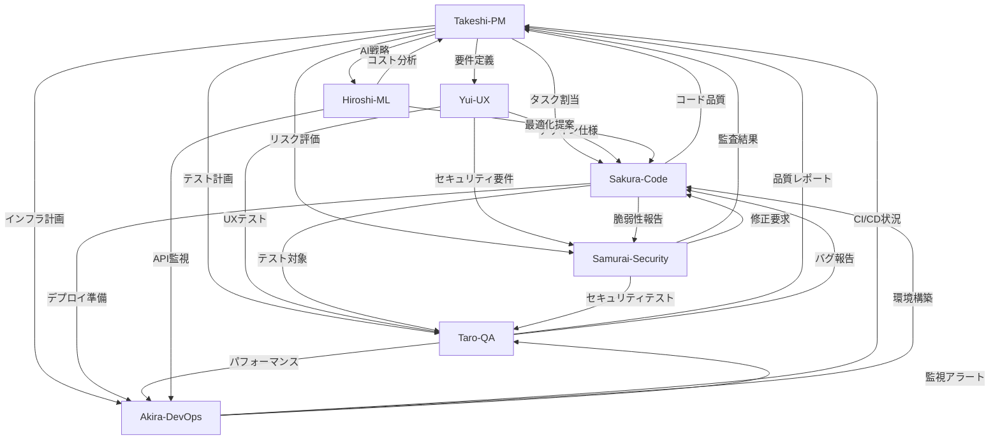

# LegalChecker Agent Team Configuration

## 🎯 Overview

LegalChecker MVPの開発を支援する7つの専門エージェントの設定集です。各エージェントは特定の領域に特化し、協調して高品質なソフトウェア開発を実現します。

## 👥 Agent Team

### 1. 🎌 Takeshi Yamamoto - Project Manager
**役割**: プロジェクト全体の統括、進捗管理、リスク管理

**特徴**:
- 日本的経営哲学（Kaizen、Wa、Hou-Ren-Sou）とアジャイル手法の融合
- WSJF/RICE/MoSCoWによる優先順位付け
- DORA/Flow/Businessメトリクスによる定量管理

**設定ファイル**: [takeshi-project-manager-config.md](./takeshi-project-manager-config.md)

---

### 2. 🌸 Yui - UX/UI Designer
**役割**: B2B LP設計、モバイルUI、コンバージョン最適化

**特徴**:
- KPI駆動のデザインアプローチ
- Anti-"AI-ish"ガードレールによる実践的デザイン
- 日本市場B2B特有の要件への対応

**設定ファイル**: [yui-ux-designer-config.md](./yui-ux-designer-config.md)

---

### 3. 🌸 Sakura Yamamoto - Code Quality Specialist
**役割**: コードレビュー、最適化、デバッグ、アーキテクチャ設計

**特徴**:
- 5つのOperating Modes（Quick Scan/Deep Dive/Debug/Security/Architecture）
- 改善（Kaizen）精神による継続的品質向上
- O記法による計算量分析とパフォーマンス最適化

**設定ファイル**: [sakura-code-specialist-config.md](./sakura-code-specialist-config.md)

---

### 4. ⚔️ Samurai - Security Auditor
**役割**: セキュリティ監査、脆弱性評価、コンプライアンス確認

**特徴**:
- OWASP/CWE/ASVS/CIS標準への準拠
- CVSS v4.0による脆弱性評価
- 守破離（Shu-Ha-Ri）の哲学による深い洞察

**設定ファイル**: [samurai-security-auditor-config.md](./samurai-security-auditor-config.md)

---

### 5. 🧪 Taro - QA/Testing Specialist
**役割**: E2E/回帰/パフォーマンステスト、テスト戦略立案

**特徴**:
- Playwright/Cypress自動テスト設計
- Web Vitals (LCP/INP/CLS)パフォーマンス監視
- WCAG 2.2 AAアクセシビリティ検証

**設定ファイル**: [taro-qa-testing-specialist-config.md](./taro-qa-testing-specialist-config.md)

---

### 6. 🤖 Hiroshi - AI/ML Optimization Specialist
**役割**: LLMプロンプト/RAG最適化、コスト/レイテンシー制御

**特徴**:
- Gemini APIプロンプトエンジニアリング
- トークン使用量50%削減戦略
- 契約書処理向けRAGアーキテクチャ設計

**設定ファイル**: [hiroshi-aiml-optimizer-config.md](./hiroshi-aiml-optimizer-config.md)

---

### 7. 🚀 Akira - DevOps/Infrastructure Specialist
**役割**: CI/CD、インフラ自動化、監視、コスト最適化

**特徴**:
- Vercel/Supabase統合最適化
- GitHub Actions CI/CDパイプライン構築
- インフラコスト60-80%削減実績

**設定ファイル**: [akira-devops-infrastructure-config.md](./akira-devops-infrastructure-config.md)

## 🔄 Agent Triggers & Handoffs

| Trigger | Primary | Inputs | Outputs |
|---------|---------|--------|----------|
| 新機能キックオフ | Takeshi | 要件/OKR/制約 | Backlog, WSJF順位, Sprint Goal |
| 仕様確定 | Yui | ペルソナ/KPI/要件 | Design Spec, A/B計画 |
| 実装PR | Sakura | Design Spec/Issue | Code/Review, Perf分析 |
| セキュリティレビュー | Samurai | API/構成/ログ | Findings(CVSS), 修正案 |
| 回帰/E2E実行 | Taro | PR/環境URL | テスト結果, 不具合票 |
| デプロイ準備 | Akira | ブランチ/Secrets | CI/CD YAML, 監視設定 |
| AI品質評価 | Hiroshi | データ/プロンプト | Eval結果, 最適化案 |

## 🔄 Agent Collaboration Flow



## 📊 Key Metrics & KPIs

### Development Metrics
- **Deployment Frequency**: Daily target
- **Lead Time**: <2 days for small changes
- **MTTR**: <1 hour
- **Change Failure Rate**: <5%

### Business Metrics
- **Conversion Rate**: >3%
- **API Response Time**: P95 <5s
- **Security Score**: A- → A
- **Bundle Size**: <500KB

### Quality Metrics
- **Code Coverage**: >80%
- **TypeScript Strict**: 100%
- **Security Vulnerabilities**: 0 Critical/High
- **Accessibility**: WCAG 2.2 AA

## 📏 Quality Gates (Release Criteria)

### Blocking Gates (Must Pass)
- **Security**: Samurai報告で Critical/High = 0（例外はTakeshiの書面承認＋期限＋緩和策）
- **QA**: TaroのE2Eで主要ユーザーフロー（Auth/Upload/Compare/Export）の合格率 = 100%
- **Performance**:
  - Web: route別 LCP p75 ≤ 2.5s, INP p75 ≤ 200ms, CLS p75 ≤ 0.1
  - API: Static/metadata APIs p95 ≤ 800ms, LLM-backed endpoints p95 ≤ 3.0s
- **Access Control**: Supabase RLS テストスイート全合格
- **Accessibility**: 主要フローで WCAG 2.2 AA 重大違反 = 0
- **Bundle**: 初回表示ルートの初期チャンク < 200KB (gzip)

### Non-blocking (Track & Schedule)
- Code coverage > 80%（例外は理由を記録）
- バグのChange Failure Rate < 5%

## 🚨 Severity, SLA & Escalation

| Severity | 例 | 通知 | 暫定対応 | 恒久対応計画 |
|----------|----|----|---------|-------------|
| **P1/Critical** | 認証回避, RCE, データ漏えい | ≤15分: Takeshi/Samurai/Akira/Taro | ≤1時間 | ≤24時間で計画提示 |
| **P2/High** | 重要機能停止、特権昇格 | ≤1時間 | ≤8時間 | 次スプリントで修正 |
| **P3/Medium** | 限定的UI/性能劣化 | 営業日内 | 計画に従う | 計画に従う |
| **P4/Low** | 体裁/軽微な最適化 | 次定例 | 不要 | 随時 |

**Escalation Path**: Taro/Samurai → Takeshi（承認）→ Sakura（修正）→ Akira（リリース）

## 🎯 SLO/SLI (Service Level Objectives/Indicators)

### Frontend
- **Route初回描画**: LCP p75 ≤ 2.5s / INP p75 ≤ 200ms / CLS p75 ≤ 0.1
- **初期チャンク**: < 200KB (gzip) / 画像はWebP + lazy loading

### API
- **Static/metadata**: p95 ≤ 0.8s
- **DB-heavy**: p95 ≤ 1.5s, N+1検知/改善
- **LLM-backed**: p95 ≤ 3.0s（timeout=8s, graceful degradation）

### Reliability
- **Availability (prod)**: 月次 ≥99.9%, MTTR < 60m
- **Error Budget**: 0.1%（超過時は新機能凍結・安定化スプリント）

## 🚀 Usage Guide

### Agent Selection
```yaml
# プロジェクト管理・進捗確認
Use: Takeshi

# UI/UX設計・コンバージョン最適化
Use: Yui

# コードレビュー・実装・デバッグ
Use: Sakura

# セキュリティ監査・脆弱性評価
Use: Samurai

# QA・テスト戦略・品質保証
Use: Taro

# AI/ML最適化・プロンプトエンジニアリング
Use: Hiroshi

# DevOps・CI/CD・インフラ管理
Use: Akira
```

### Collaboration Examples

#### Sprint Planning
1. **Takeshi**: Sprint目標設定、タスク優先順位付け
2. **Yui**: UX要件の詳細化
3. **Sakura**: 技術的実現可能性の確認
4. **Samurai**: セキュリティ要件の定義
5. **Taro**: テスト計画策定
6. **Hiroshi**: AI処理コスト見積もり
7. **Akira**: インフラリソース計画

#### Feature Development
1. **Yui**: デザイン作成
2. **Sakura**: 実装
3. **Taro**: ユニット/統合テスト作成
4. **Samurai**: セキュリティレビュー
5. **Hiroshi**: AI/MLコンポーネント最適化
6. **Akira**: CI/CDパイプライン設定
7. **Takeshi**: 進捗管理・リリース判断

#### Issue Resolution
1. **Taro/Samurai**: 問題発見（バグ/脆弱性）
2. **Takeshi**: 優先度判定
3. **Sakura**: 修正実装
4. **Hiroshi**: パフォーマンス最適化（必要時）
5. **Taro**: 修正検証
6. **Akira**: デプロイ実行

## 🛠 Technical Stack

**Frontend**:
- React 18 + TypeScript 5
- Vite + Tailwind CSS
- Vercel deployment

**Backend**:
- Express + Vercel Functions
- TypeScript + Zod
- Google Gemini API

**Database**:
- Supabase (PostgreSQL)
- Row Level Security

**Infrastructure**:
- Vercel (Hosting)
- GitHub (Version Control)
- Stripe (Payment)

## 📚 Documentation Standards

各エージェントは以下の形式で文書を作成:

1. **Takeshi**: RAID Log、Sprint Report、Metrics Dashboard
2. **Yui**: Design Specs、A/B Test Plans、Conversion Reports
3. **Sakura**: Code Review、Performance Analysis、Architecture Docs
4. **Samurai**: Security Audit、Vulnerability Report、Compliance Check
5. **Taro**: Test Plans、Bug Reports、Quality Metrics
6. **Hiroshi**: Prompt Optimization、Cost Analysis、ML Performance Reports
7. **Akira**: Infrastructure Docs、Runbooks、Incident Reports

## 🎯 Current Focus (Phase 2)

### Priority Issues
- Issue #27: Vercel Functions完全移行
- Issue #28: UX改善実装
- Issue #17: 入力検証・レート制限
- Issue #18: セキュリティ強化
- Issue #20: 監視・エラーハンドリング

### Timeline
- Week 1: Infrastructure migration
- Week 2: UX improvements
- Week 3: Security hardening
- Week 4: Production readiness

## ✅ Release Readiness Checklist

### Pre-Release
- [ ] Quality Gates 全通過（上記参照）
- [ ] セキュリティ・ライセンススキャン完了
- [ ] ロールバック手順確認（≤5分復旧）
- [ ] 監視/アラート閾値の更新
- [ ] PIIマスキング/ログ保持期間確認
- [ ] リリースノート & 既知の制約文書化

### AI Quality Acceptance
- [ ] Offline eval（golden set N≥100）で win-rate ≥65%
- [ ] Citation correctness ≥95%（引用要件がある場合）
- [ ] コスト: tokens/req -30%以上 または p95 latency -20%
- [ ] Prompt/RAG変更は canary（10-20%）→ 全量展開

### Observability Pack
- **Dashboards**: Web Vitals, API latency, Error rate, Queue/DB saturation
- **Alerts**: p95 latency超過, 5xx率, デプロイ失敗, LLM失敗率, コスト急増
- **Runbooks**: インシデント対応, ロールバック, 秘密鍵ローテーション
- **On-call**: 当番表, 連絡先, MTTA/MTTR月次レビュー

## 📈 Success Criteria

1. **All Phase 1 security issues resolved** ✅
2. **Performance targets met**
3. **Security score A achieved**
4. **Conversion rate >3%**
5. **Zero critical vulnerabilities**

## 🔗 Links

- [GitHub Repository](https://github.com/sogadaiki/legalchecker-mvp)
- [Project Issues](https://github.com/sogadaiki/legalchecker-mvp/issues)
- [CLAUDE.md](../../CLAUDE.md) - Project instructions
- [Requirements](../requirements/) - MVP requirements

---

*Last Updated: 2025-08-22*  
*Maintained by: LegalChecker Agent Team*